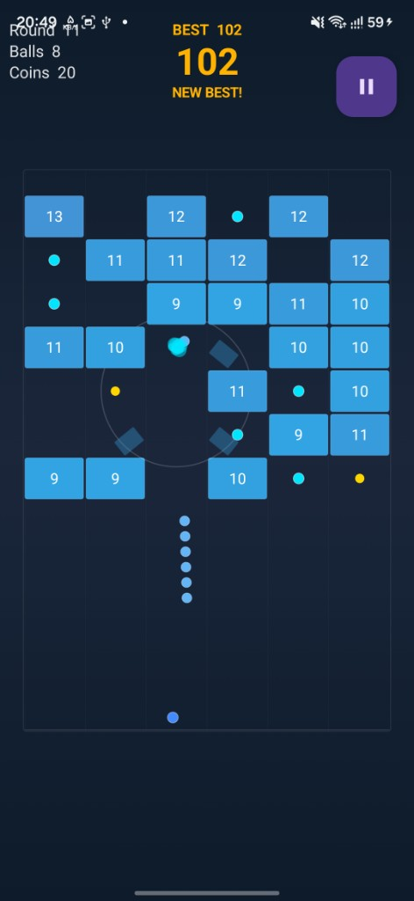
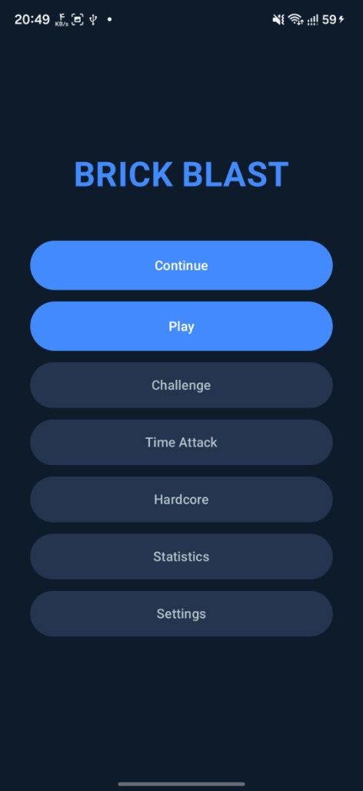
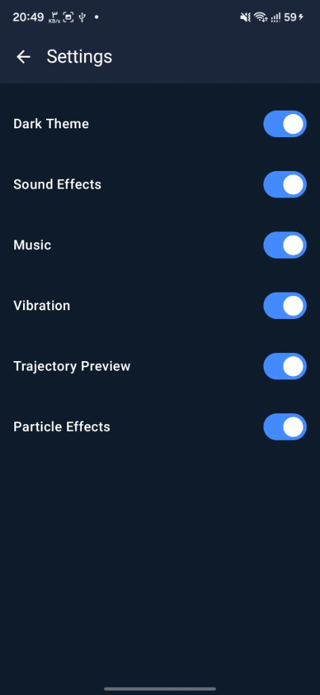
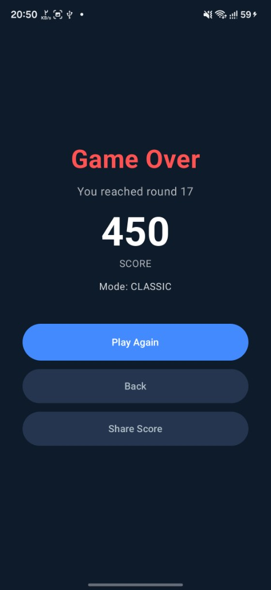

# Brick Blast

A fast, offline brick-breaker for Android built with **Kotlin** and **Jetpack Compose**.

Drag to aim, release to launch a stream of balls, and bounce them off the walls to smash descending bricks before they reach the bottom. Each round the bricks move down and a new row appears — plan your angles carefully.

**Package:** `com.mostafa.brickblast`

## Screenshots

| Gameplay | Main menu |
|:---:|:---:|
|  |  |

| Settings | Game over |
|:---:|:---:|
|  |  |

## Features

- Turn-based aim-and-shoot gameplay with a dotted trajectory preview
- Custom physics engine (60 FPS, spatial-hash collisions, swept ball movement)
- Collectable extra balls — your arsenal grows every round
- Power-ups: bomb, laser, multi-ball, and double damage
- Game modes: **Classic**, **Challenge**, **Time Attack**, **Hardcore**
- Brick destruction animations and particle effects
- Light and dark themes with a Telegram-style animated theme switch
- High-score tracking, statistics, and auto-save
- Share your score as an image to social apps
- Completely offline — no ads, no tracking, no internet permission

## Tech stack

| Layer | Libraries |
|---|---|
| UI | Jetpack Compose, Material 3 |
| Architecture | MVVM, StateFlow, Coroutines |
| DI | Hilt |
| Navigation | Navigation Compose (type-safe routes) |
| Persistence | Room, DataStore |
| Rendering | Compose Canvas API |

## Build

**Requirements:** Android Studio Ladybug or newer, JDK 17, Android SDK 35, min SDK 26.

```bash
# Debug APK
./gradlew assembleDebug

# Release APK (minified)
./gradlew assembleRelease
```

The debug APK is written to `app/build/outputs/apk/debug/`.

### Local SDK path

Create `local.properties` in the project root if it does not exist:

```properties
sdk.dir=/path/to/Android/Sdk
```

## F-Droid

This project is prepared for [F-Droid](https://f-droid.org/) submission:

- **License:** MIT (see [LICENSE](LICENSE))
- **Metadata:** [metadata/com.mostafa.brickblast.yml](metadata/com.mostafa.brickblast.yml)
- **Store listing:** [fastlane/metadata/android/en-US/](fastlane/metadata/android/en-US/)
- **Screenshots:** [fastlane/metadata/android/en-US/images/phoneScreenshots/](fastlane/metadata/android/en-US/images/phoneScreenshots/)

Before submitting, push the repo to a public git host, tag a release (e.g. `v1.0.0`), and update the URLs in the F-Droid metadata file.

## Project structure

```
app/src/main/java/com/mostafa/brickblast/
├── data/          Room entities, DAOs, DataStore, repositories
├── domain/        Models and repository interfaces
├── game/          Engine, physics, particles, renderer, audio
├── navigation/    Type-safe routes and NavGraph
├── di/            Hilt modules
└── ui/            Screens, ViewModels, theme, components
```

## Contact

**Developer:** Mostafa Ashrafi  
**Email:** [ashrafimostafa@gmail.com](mailto:ashrafimostafa@gmail.com)

## License

[MIT](LICENSE) — Copyright (c) 2026 Mostafa Ashrafi
